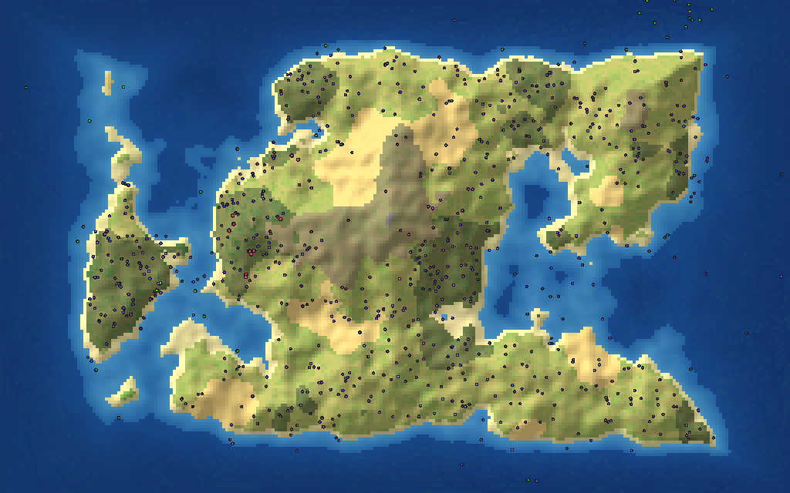

# Neuron World

A WorldBox-style god game where every creature is an AI agent with its own neural-network brain, built on top of the Neuron-Box Unity project.



*Rendered by the headless tool (`--png`). Map colours match the game; creatures are drawn as dots.*

Creatures see food, water and each other. They feel hunger and pain, and decide for themselves how to move, eat, fight and breed. Children inherit their parent's body and brain with small mutations, so the population evolves over time. Lineages that drift apart become new species with their own names. You watch it happen and intervene with god powers: spawn new life, raise mountains, dig seas, start fires, call down lightning and meteors.

## Playing

1. Open the project in **Unity 6000.2.13f1** (URP 2D).
2. Open `Assets/Scenes/World.unity` and press Play. It is also the first scene in the build settings.

| Input | Action |
|---|---|
| Left click | Use the selected god power (Inspect selects a creature) |
| Right/middle drag, WASD, arrows | Move the camera |
| Scroll, `+` / `-` | Zoom |
| Space | Pause |
| 1 / 2 / 3 / 4 / 5 | Speed 1x / 2x / 5x / 10x / max |
| Tab | Colour creatures by genes, species, diet or energy |
| F | Follow the selected creature |
| Delete | Smite the selected creature |
| `[` / `]` | Brush size |
| Esc | Back to Inspect, then deselect |
| H | Help |

**God powers:**
- **Create life:** Herbivores, Omnivores and Carnivores each create a brand-new species; click in the sea to get sea creatures. Clone selected makes copies of a creature you like.
- **Shape the world:** Rain, Raise land, Lower land.
- **Disasters and blessings:** Fire (spreads through grass and forest), Lightning, Meteor, Bless (feeds and heals).

**Panels:**
- **Species list:** click a species to follow one of its members.
- **Event feed:** new species, extinctions and meteor strikes.
- **World panel:** population graph and statistics.
- **Creature inspector:** genes, vitals and a live view of the creature's brain. Hover a neuron to see what it senses or does.

## How the creatures work

Each tick every creature **senses**, **thinks** and **acts**.

**Senses (37 inputs):**
- **Its own state:** energy, health, age, food under its mouth, whether it's in water, pain, current speed.
- **Two internal clocks,** one fast and one slow.
- **Hearing:** the sum of nearby creatures' signals.
- **Crowding:** how many creatures are close by.
- **Vision:** five sectors across the 180° in front of it. Each sector reports food (only food this creature can digest), water, the closest creature, whether that creature is kin, and whether it's bigger or smaller.

**Brain:** an evolvable recurrent network descended from Neuron-Box's `NeuralNetwork`. It has input, hidden and output neurons with sparse weighted connections. Every neuron keeps part of its previous activation as short-term memory; Neuron-Box used a fixed 0.98 decay, here the amount evolves per neuron.

**Actions (6 outputs):** move forward, turn, eat, attack, reproduce, signal.

**Energy:** creatures burn energy for their body size, movement, brain size and eyesight.
- Plants regrow slowly, so food limits the population, and the seasons make it boom and bust.
- A creature's diet gene sets how well it digests plants versus meat.
- Attacks only really hurt if you have a carnivore's teeth.
- Bodies become meat, returning less energy than went into them, so predators can only live off what plants produced.

**Inheritance and mutation:** each child is a mutated copy of its parent.
- Body genes change: size, speed, diet, aquatic, vision, colour, the mutation rate itself, and how much energy each child gets.
- Brain weights change, and connections and hidden neurons are added and removed. This enables the neuron add/remove mutation that was commented out in Neuron-Box.

**Species:** a child whose genome drifts too far from its species' current members starts a new species, which is named when it reaches 8 members.

New species start with a few instinct connections (steer to food, eat, breed when fed; hunters chase and bite other species) plus random wiring. Evolution is free to rewire all of it. Turn this off with `startWithInstincts` to begin from fully random brains, as Neuron-Box did.

## Code layout

```
Assets/Scripts/World/Core/    Pure C# simulation, no UnityEngine (also runs headless)
  Simulation.cs    world loop: sensing, actions, eating, combat, reproduction, god powers
  Brain.cs         evolvable recurrent neural network + sense/action layout (BrainIO)
  Genome.cs        body genes + mutation + genetic distance
  Species.cs       species registry, naming, speciation bookkeeping
  WorldMap.cs      terrain generation, plants, meat, fire, terraforming
  MapPalette.cs    map colours (shared by Unity and the headless PNG export)
  SimSettings.cs   every tunable rule, editable in the WorldManager inspector
Assets/Scripts/World/Unity/   Unity front end, all built from code (no prefabs or Canvas)
  WorldManager.cs  entry point: runs the simulation, speed control, hotkeys, selection
  WorldUI.cs       IMGUI interface; BrainView / GraphView draw the brain and population graph
  GodPowers.cs     mouse tools; MapRenderer / CreatureRenderer / EffectsRenderer draw the world
Tools/HeadlessSim/            .NET console app that runs the core without Unity
```

The original Neuron-Box scenes and scripts (`SampleScene`, `Organism`, `NeuralNetwork`, modules and so on) are unchanged.

## Tuning without Unity

`Tools/HeadlessSim` compiles the same `Core` files, with C# 9 like Unity, and runs a world in the terminal. It's handy for checking a balance change over thousands of ticks in seconds. You need the .NET 8 SDK.

```
cd Tools/HeadlessSim
dotnet run -c Release -- --ticks 30000 --every 2500 --seed 42
dotnet run -c Release -- --set attackDamage=20 --set plantGrowth=1.5   # try other rules
dotnet run -c Release -- --ticks 12000 --png world.png                 # save a picture of the world
```

It prints population by diet, species counts, the highest generation, how each diet lives and dies, the largest species and recent events.

Input uses Unity's legacy `Input` class, like the rest of Neuron-Box. **Active Input Handling** is already set to **Both** in Project Settings; keep it that way.
